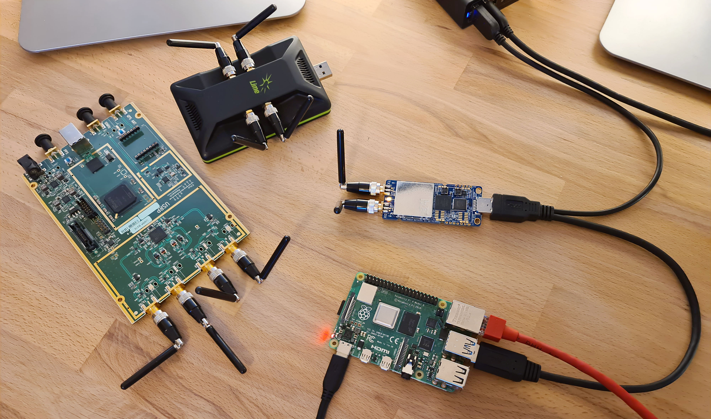
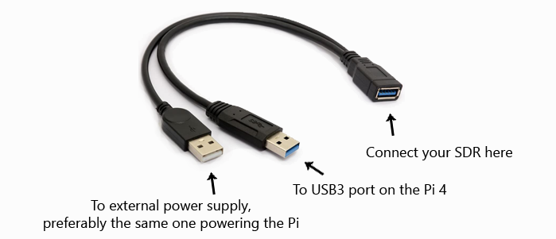

## Introduction

srsRAN is a 4G and 5G software radio suite. The 4G LTE systems includes a core network and an eNodeB. Most people in the srsRAN community run the software on high performance computers, however the eNodeB can also be run on the low power Raspberry Pi 4 with a variety of SDRs.

The concept of an ultra low cost, low power and open source SDR LTE femtocell has a lot of people excited!




## Pi4 eNodeB Hardware Requirements

The setup instructions provided below have been tested with a *Raspberry Pi 4B /4GB rev 1.2* running either

Ubuntu Server 20.04 LTS aarch64 [download link](https://ubuntu.com/download/raspberry-pi)
Raspberry Pi OS October 2021 [download link](https://www.raspberrypi.com/software/operating-systems/)

It has not been tested with the rev 1.1 board, boards with 2GB of RAM or alternative operating systems. You can visually identify your Pi4 hardware revision – [this doc from Cytron shows you how](https://tutorial.cytron.io/2020/02/22/how-to-check-if-your-raspberry-pi-4-model-b-is-rev1-2)

This setup has been tested with a USRP B210, a LimeSDR-USB and a LimeSDR-Mini.

!! Note

* When using the USRP B210, you can create a 2x2 MIMO cell with srsenb. It is also possible to run the srsepc core network on the Pi too.

* When using either of the LimeSDRs, you can only create a 1x1 SISO cell with srsenb. The core network must be run on a separate device.

* Due to the power requirements of the SDRs, you must use an external power supply. This can be achieved with a USB ‘Y’ cable, such as this:




## Software Setup

Have tried to make this as easy as possible. Automatic setup is run in two parts.
```
cd
git clone git@github.com:kbarlee/srsranPi.git
cd srsranPi


sudo ./setup_part1.sh

... wait for it to finish
reboot

sudo ./setup_part2.sh
```

If you want to go through this manually, check out the app note I wrote for the srsRAN website:
https://docs.srsran.com/en/latest/app_notes/source/pi4/source/index.html